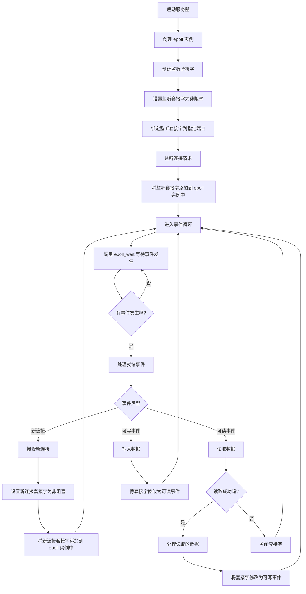

定义：I/O多路复用是指在单线程中同时监视多个文件描述符的状态变化（如可读、可写、异常等），当其中一个或多个文件描述符发生状态变化时，内核会通知应用程序进行相应的处理。

## 1. epoll 与 select/poll 区别

`epoll`的实现代码[fs/eventpoll.c](https://github.com/torvalds/linux/blob/master/fs/eventpoll.c)，其分为三个接口函数：

- `epoll_create`: 创建一个`epoll`实例，返回一个文件描述符。
- `epoll_ctl`: 向`epoll`实例中添加、修改或删除需要监视的文件描述符。
- `epoll_wait`: 等待`epoll`实例中监视的文件描述符发生状态变化，并返回就绪的文件描述符列表。

具体流程分为两个阶段：


**注册阶段（`epoll_ctl` EPOLL_CTL_ADD）：**

1. 为目标 `fd` 创建 `epitem`，插入 `ep->rbr` 红黑树。
2. 调用 `ep_item_poll(epi, &epq.pt, 1)`，内部通过 `ep_ptable_queue_proc` 分配一个 `eppoll_entry`，将 `ep_poll_callback` 注册为回调函数，并通过 `add_wait_queue` 将其**挂入目标 fd（如 socket）自身的等待队列**，完成事件监听挂钩。

**等待/触发阶段（`epoll_wait`）：**

1. `epoll_wait` 调用 `ep_poll`，先检查 `ep->rdllist` 是否有就绪事件：若有则直接调用 `ep_try_send_events` 传递事件并返回；若无则将当前进程加入 `ep->wq`（**epoll 实例自身**的等待队列），挂起进程等待唤醒。
2. 当目标 fd（如 socket）收到数据后，内核驱动层（网络栈/设备驱动）调用 `wake_up()` 唤醒该 fd 自身的等待队列，从而触发挂在其上的回调 `ep_poll_callback`。
3. `ep_poll_callback` 将对应 `epitem` 加入 `ep->rdllist`（若此时正在向用户空间传输事件，则暂存于 `ep->ovflist` 溢出链表），然后调用 `wake_up(&ep->wq)` 唤醒 `epoll_wait` 中挂起的进程。
4. 进程被唤醒，`ep_poll` 调用 `ep_send_events`，后者先通过 `ep_start_scan` 调用 `list_splice_init(&ep->rdllist, txlist)` 将 `rdllist` 中的 `epitem` **原子地转移**到临时链表 `txlist`，同时将 `ep->ovflist` 从 `EP_UNACTIVE_PTR` 置为 `NULL`，以接收此传输期间新到的事件。
5. `ep_send_events` 遍历 `txlist` 中每个 `epitem`，调用 `ep_item_poll`（内部调用 `vfs_poll`）获取 fd 上**最新**的 events（防止使用过时状态），再将 events 与 `epoll_event.data` 通过 `epoll_put_uevent` 拷贝到用户空间。**LT 模式**下若事件仍未处理完，`epitem` 会被重新加回 `ep->rdllist`，保证下次 `epoll_wait` 仍能返回；**ET 模式**则不重新加入。
6. `ep_done_scan` 将 `ovflist` 中传输期间到达的新事件合并回 `ep->rdllist`，并在 `rdllist` 非空时再次调用 `wake_up(&ep->wq)` 通知等待者。

`epoll_wait`流程如下：


图中涉及两个不同的等待队列：目标 fd（如 socket）自身的等待队列（`ep_poll_callback` 注册于此，收到数据时被触发）；以及 `ep->wq`（epoll 实例的等待队列，`epoll_wait` 调用者挂于此处休眠）。两者概念不同，需加以区分。

### 1.1. epoll 与 poll/select 特点总结

`select`/`poll`给定一个`fd`数组，每次都是从用户态传递到内核态，内核态遍历该数组，填充有事件发生的`fd`。然后内核态将该数组传回用户态，用户态再次遍历该数组，处理有事件发生的`fd`。因此，`select`/`poll`的时间复杂度为`O(n)`。

`epoll`只在有事件发生时才通知用户程序，只将就绪的`fd`返回给用户程序。`epoll`有如下特点：

- `红黑树`: 内核中`epoll_ctl`将需要监听的文件描述符(针对网络通信就是套接字)时，保存在红黑树中。添加/删除/索引的时间复杂度为`O(log n)`。
- `rdllist`: `ep->rdllist`是内核存储的就绪事件列表，当有事件发生时比如套接字数据可读，驱动将fd对应的`epitem`加入到`rdllist`中（通过fd等待队列上的回调函数`ep_poll_callback`）。`epoll_wait`通过`ep_start_scan`将`rdllist`转移到临时`txlist`后扫描处理，更新对应的`epoll_event`数据，并返回给用户程序。

## 2. ET模式与LT模式区别

`LT`模式：当`fd`就绪时，`epoll_wait` 会一直返回该`fd`，直到事件被处理。例如，如果一个`socket`连接有数据可读，`epoll_wait` 会每次都返回该`socket` `fd`，直到数据被完全读取。

`ET`模式: 当`fd`从未就绪变为就绪时，`epoll_wait` 只会返回一次该`fd`。例如，如果**一个`socket`有数据可读（kernel中缓冲区由空变为非空），`epoll_wait` 只会在数据第一次到达时返回该套接字，之后即使有更多数据到达，也不会再次返回。**

`ET`的这个特性使得其要求应用程序必须一次性读取所有数据，否则可能会错过后续的数据到达事件，不能实时处理数据。因此，使用`ET`模式时，必须将套接字设置为非阻塞模式，并在事件处理函数中循环读取数据，直到返回`EWOULDBLOCK`错误。

以下是`ET`模式下的事件处理示例：

```cpp
while (1) {
    ssize_t n = read(fd, buffer, sizeof(buffer));
    if (n == -1) {
        if (errno == EAGAIN || errno == EWOULDBLOCK) {
            break; // 数据读完
        }

        // 处理其他异常情形
    }

    // 处理读取的数据
}
```

> 明显的，`ET`模式相较于`LT`模式，减少了系统调用次数，提高了性能。

## 3. 设置socket为非阻塞

|                         Blocking read                         |                          Non-blocking read                           |
| :-----------------------------------------------------------: | :------------------------------------------------------------------: |
|  |  |

`ET`模式下，使用阻塞模式`socket`，如果数据量较大，需要多次`read`，最后一次可能没有数据可读，此时`read`将一直阻塞。使用非阻塞模式`socket`，`read`返回`EWOULDBLOCK`即代表数据读完。

## 4. epoll 调用流程图



## 5. libEvent

`libEvent`是一个跨平台的事件通知库，提供了统一的接口来处理不同操作系统上的事件驱动机制（如`select`、`poll`、`epoll`等）。它封装了底层的事件处理细节，使得开发者可以更方便地编写高性能的网络应用程序。

`libEvent`可以处理的事件类型包括（还有很多高级功能没有列出来，比如处理复杂的事件组合、优先级事件等）：

- **I/O事件**：如套接字可读、可写等。
- **定时器事件**：在指定时间后触发的事件。
- **信号事件**：当特定信号发生时触发的事件，使用`evsigsel`。

`libEvent`基本使用流程为，首先创建一个事件基础设施（`event_base`），然后为每个需要监视的事件创建一个事件对象（`event`），并将其添加到基础设施中。最后，调用`event_base_dispatch`进入事件循环，等待事件发生并处理。

资源：

- [PcapNG Playback](https://gitee.com/ground_station/pcapng_playback/blob/master/src/console/consolePlay.cc)：基于`libEvent`实现的时间戳回放
- [libevent](https://www.cnblogs.com/yubo-guan/p/18219497)：博客文章
- [23.libevent](https://www.cnblogs.com/codemagiciant/p/17853120.html)：博客文章

## 参考

- [Linux下的I/O复用与epoll详解](https://www.cnblogs.com/lojunren/p/3856290.html)
- [gitee -- epoll sample](https://gitee.com/hpc_5/epoll_test)
- [Linux I/O 模型详解](https://flyflypeng.tech/linux/2017/07/11/Linux-IO%E6%A8%A1%E5%9E%8B.html)
- [Blocking I/O, Nonblocking I/O, And Epoll](https://eklitzke.org/blocking-io-nonblocking-io-and-epoll)
- [Linux I/O multiplexing examples](https://github.com/hechaoli/linux_io_multiplexing)
- [Network Programming: How is epoll implemented?](https://www.quora.com/Network-Programming-How-is-epoll-implemented)：见Nelson Elhage的回答
- [Linux 内核的 epoll 实现](https://www.bluepuni.com/archives/epoll-in-depth/)
