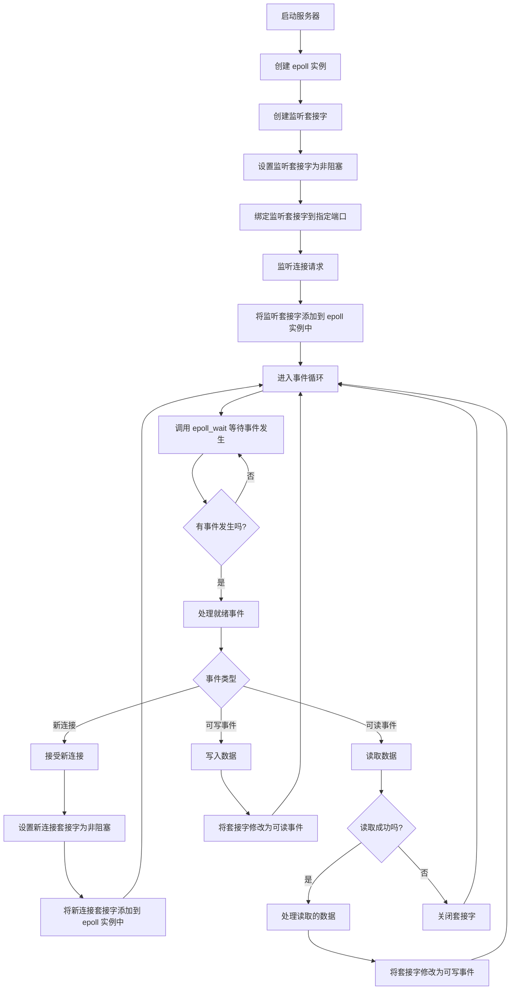

## 1. epoll 与 select/poll 区别 ##

1. `select`由于采用轮询的方式，即轮询所有文件描述符。现实情况中，并发活跃的连接数远小于总连接数(文件描述符列表)，`select`的效率较低。
2. `poll`与`select`类似，也是采用轮询的方式，但是`poll`没有最大文件描列表长度述符限制（默认是`FD_SETSIZE` = 1024）。

例如，`poll`函数使用`pollfd`数组来查询事件，每次都需要将该`pollfd`数组传递给内核，内核再遍历该数组，查找有事件发生的`fd`，特别是数组比较大的时候，效率低下。

相比较而言，`epoll`只在有事件发生时才通知用户程序，效率较高。`epoll`使用三个高效的数据结构：

* `mmap`: 内核空间和用户空间共享一块内存(`epoll_event`数组)。`epoll_wait`过程中，内核将等到的`event`数据直接写入到`epoll_event`数组中。
* `红黑树`: `epoll_ctl`将需要监听的文件描述符(针对网络通信就是套接字)时，保存在红黑树中。添加/删除/索引的时间复杂度为`O(log n)`。
* `rdlist`: `rdlist`是内核存储的就绪事件列表，当有事件发生时比如套接字数据可读，驱动将fd对应的`epitem`加入到`rdlist`中（通过fd上的回调函数`ep_poll_callback`）。`epoll_wait`从`rdlist`中取出`epitem`，更新对应的`epoll_event`数据，并返回给用户程序。

具体流程如下：

1. `epoll_wait`调用`ep_poll`，当`rdlist`为空（无就绪`fd`）时挂起当前进程，直到`rdlist`不空时进程才被唤醒。
2. 文件`fd`状态改变（buffer由不可读变为可读或由不可写变为可写），导致相应`fd`上的回调函数`ep_poll_callback()`被调用。
3. `ep_poll_callback`将相应`fd`对应`epitem`加入`rdlist`，导致`rdlist`不空，进程被唤醒，`epoll_wait`得以继续执行。
4. `ep_events_transfer`函数将`rdlist`中的`epitem`拷贝到`txlist`中，并将`rdlist`清空。
5. `ep_send_events`函数（很关键），它扫描`txlist`中的每个`epitem`，调用其关联`fd`对用的`poll`方法。此时对`poll`的调用仅仅是取得`fd`上较新的`events`（防止之前`events`被更新），之后将取得的`events`和相应的`fd`发送到用户空间（封装在`struct epoll_event`，从`epoll_wait`返回）。

`epoll_wait`流程如下：

其中，`wq`为socket等待队列。

## 2. ET模式与LT模式区别 ##

`LT`模式：当`fd`就绪时，`epoll_wait` 会一直返回该`fd`，直到事件被处理。例如，如果一个`socket`连接有数据可读，`epoll_wait` 会每次都返回该`socket` `fd`，直到数据被完全读取。

`ET`模式: 当`fd`从未就绪变为就绪时，`epoll_wait` 只会返回一次该`fd`。例如，如果一个`socket`有数据可读，`epoll_wait` 只会在数据第一次到达时返回该套接字，之后即使有更多数据到达，也不会再次返回，直到所有数据被读取完并且`socket` `fd`再次变为`未就绪状态`。

## 3. 设置socket为非阻塞 ##

|                         Blocking read                         |                          Non-blocking read                           |
| :-----------------------------------------------------------: | :------------------------------------------------------------------: |
|  |  |

`ET`模式下，使用阻塞模式`socket`，如果数据量较大，需要多次`read`，最后一次可能没有数据可读，此时`read`将一直阻塞。使用非阻塞模式`socket`，`read`返回`EWOULDBLOCK`即代表数据读完。

## 4. epoll 调用流程图 ##

## 参考 ##

* [Linux下的I/O复用与epoll详解](https://www.cnblogs.com/lojunren/p/3856290.html)
* [gitee -- epoll sample](https://gitee.com/hpc_5/epoll_test)
* [Linux I/O 模型详解](https://flyflypeng.tech/linux/2017/07/11/Linux-IO%E6%A8%A1%E5%9E%8B.html)
* [Blocking I/O, Nonblocking I/O, And Epoll](https://eklitzke.org/blocking-io-nonblocking-io-and-epoll)

