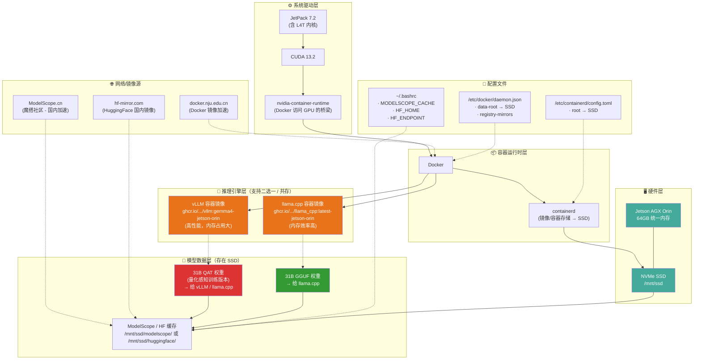

## 1. NVIDIA Jetson Orin AGX 安装

使用 Nvidia Jetson SDK Manager 安装 Jetson Orin AGX 系列设备的系统镜像。截止目前最新版为 7.2， Ubuntu 24.04。安装完成之后，安装如下软件包：

```bash
# 安装 Python
sudo apt update
sudo apt install python3
sudo apt install python3-pip
```

```bash
# 安装 JetPack（含 CUDA、cuDNN、TensorRT 等组件），需在 jtop 之前装好
sudo apt install nvidia-jetpack
```

```bash
# 安装 jtop（依赖 JetPack 组件才能正常显示信息）
sudo pip3 install -U pip
sudo pip3 install --break-system-packages -U jetson-stats
# https://github.com/rbonghi/jetson_stats
```

查看已经安装的组件：

```bash
git clone https://github.com/jetsonhacks/jetsonUtilities.git
cd jetsonUtilities
python3 jetsonInfo.py
```

安装 GTest：

```bash
sudo apt install libgtest-dev libgmock-dev
```

### 1.A. 参考及资源

#### 1.A.1. 参考

- [NVIDIA Jetson Linux 36.4](https://developer.nvidia.cn/embedded/jetson-linux-r3640)：官方资料页面，包含组件以及驱动源码下载列表
- [Nvidia Jetson AGX Orin开发板配置与使用](https://zhaoxuhui.top/blog/2024/03/27/notes-on-nvidia-jetson-agx-orin-installation.html)：安装更多软件包，比如 SLAM，深度学习框架等。
- [Nvidia Jetson AGX Orin系统刷写](https://yanjingang.com/blog/?p=9092)

#### 1.A.2. 资源

- [Jetson AI Lab -- 支持的LLM模型](https://www.jetson-ai-lab.com/models/)
- [JetPack 7.2: Jetson Software Goes Agentic with Jetson Linux 39.2](https://forums.developer.nvidia.com/t/jetpack-7-2-jetson-software-goes-agentic-with-jetson-linux-39-2/372056)
- [jetson skills](https://github.com/NVIDIA-AI-IOT/jetson-device-skills)：官方github仓库
- [Jetson AI Lab -- Supported Models](https://www.jetson-ai-lab.com/models/)：Jetson AI Lab 模型库

## 2. CLI 条件下连接 WIFI

刷写完系统后，若只有命令行环境，先配置网络，后续的 `apt`、`git`、`docker pull` 等操作都需要联网。

```bash
# 查看网卡列表
nmcli device status

# 扫描附近的WiFi网络
nmcli device wifi list

# 连接到指定的WiFi网络（替换SSID_NAME和WIFI_PASSWORD）
sudo nmcli device wifi connect "SSID_NAME" password "WIFI_PASSWORD"
```

## 3. 在 Jetson Orin AGX 上挂载 SSD，挂载 Docker 目录及用户目录

> 这里记录我在 Jetson Orin AGX 上挂载 M.2 NVMe SSD（约 1TB）的过程。前提是 SSD 已正确插入，系统能看到设备 `/dev/nvme0n1`（目前未分区）。所有操作均需要 **root**（使用 `sudo`）。

---

### 3.1. 创建分区 & 格式化

```bash
# 确认设备
lsblk -o NAME,SIZE,MODEL

# 使用 fdisk 创建一个主分区（占用整个磁盘）
sudo fdisk /dev/nvme0n1
# 在交互界面依次输入：
#   n   → 新建分区
#   p   → 主分区
#   1   → 分区号
#   （回车）默认起始扇区
#   （回车）默认结束扇区（使用剩余全部空间）
#   w   → 写入分区表并退出
```

完成后得到 `/dev/nvme0n1p1`。

格式化为 ext4（可根据需要换成 xfs、btrfs 等）：

```bash
sudo mkfs.ext4 -L nvme_ssd /dev/nvme0n1p1
```

查看 UUID（后续挂载会用到）：

```bash
sudo blkid /dev/nvme0n1p1
# 示例输出：/dev/nvme0n1p1: UUID="a1b2c3d4-e5f6-7890-abcd-ef1234567890" TYPE="ext4" PARTLABEL="nvme_ssd"
```

记下此 UUID（例如 `a1b2c3d4-e5f6-7890-abcd-ef1234567890`）。

---

### 3.2. 创建挂载点 & 加入开机自动挂载（/etc/fstab）

```bash
# 统一挂载点（可自行修改路径）
sudo mkdir -p /mnt/ssd

# 临时挂载测试
sudo mount /dev/nvme0n1p1 /mnt/ssd
df -hT /mnt/ssd   # 应看到约 1 TB 可用

# 写入 fstab（使用 UUID 更稳妥)
echo "UUID=a1b2c3d4-e5f6-7890-abcd-ef1234567890  /mnt/ssd  ext4  defaults,noatime  0  2" | sudo tee -a /etc/fstab

# 检查并生效
sudo mount -a
```

以后每次开机都会自动把 `/dev/nvme0n1p1` 挂载到 `/mnt/ssd`。

---

### 3.3. 把 Docker 镜像/容器数据放到 SSD

#### 3.3.1. 推荐方案：修改 Docker 的 `data-root`

```bash
# 停止 Docker
sudo systemctl stop docker

# 创建目标目录并迁移原有数据（如果有）
sudo mkdir -p /mnt/ssd/docker
sudo rsync -aXS /var/lib/docker/. /mnt/ssd/docker/

# 配置 Docker 使用新目录
sudo mkdir -p /etc/docker
sudo tee /etc/docker/daemon.json > /dev/null <<'EOF'
{
  "data-root": "/mnt/ssd/docker"
}
EOF

# 重启 Docker
sudo systemctl start docker
sudo systemctl status docker   # 确保无错误

# 验证
docker info | grep "Docker Root Dir"
# 应显示： Docker Root Dir: /mnt/ssd/docker
```

_替代方案：_ 使用符号链接（停止 Docker 后 `mv /var/lib/docker /var/lib/docker.bak && ln -s /mnt/ssd/docker /var/lib/docker`），效果相同但不如 `daemon.json` 直观。

> 这里写入的 `daemon.json` 只包含 `data-root`。在第 4 节部署 LLM 时，会把它**整体替换**为包含 `runtimes`、`registry-mirrors` 的完整版本，到时直接覆盖即可。

---

### 3.4. 把用户主目录（/home/hxf0223）也放到 SSD

如果计划在用户目录下存放大量 Docker 镜像、离线 LLM 模型等，建议把 **整个用户主目录** 挂载到 SSD。

> 注意：下面 `mv /home/hxf0223` 时，若当前正登录在该家目录下会失败。请先 `cd /`（或切到 root 用户）再操作，并确认没有进程占用家目录（可 `sudo lsof +D /home/hxf0223` 检查）。

```bash
# 在 SSD 上创建对应目录
sudo mkdir -p /mnt/ssd/home/hxf0223

# 复制现有数据（保持权限、属性）
sudo rsync -aXS /home/hxf0223/. /mnt/ssd/home/hxf0223/

# 备份原目录
sudo mv /home/hxf0223 /home/hxf0223.bak

# 绑定挂载使 /home/hxf0223 指向 SSD
sudo mount --bind /mnt/ssd/home/hxf0223 /home/hxf0223

# 加入 fstab 以实现开机自动绑定挂载
echo "/mnt/ssd/home/hxf0223  /home/hxf0223  none  bind  0  0" | sudo tee -a /etc/fstab

# 验证
df -hT /home/hxf0223   # 应看到和 /mnt/ssd 相同的可用空间
mount | grep "on /home/hxf0223"
# 应显示类似： /mnt/ssd/home/hxf0223 on /home/hxf0223 type none (rw,relatime,bind)
```

> 如果希望 **所有用户的主目录** 都放在 SSD，可把 `/mnt/ssd/home` 挂载到 `/home`，步骤类似。

---

### 3.5. 检查一切是否正常

```bash
# 检查挂载情况
df -hT /mnt/ssd /home/hxf0223 /var/lib/docker

# 检查 Docker 实际使用的目录
docker info | grep "Docker Root Dir"

# 检查用户目录是否真的指向 SSD
mount | grep "on /home/hxf0223"
```

如果输出均符合预期，说明已经成功：

- 将 M.2 SSD 挂载为 `/mnt/ssd`（额外存储）。
- 将 Docker 数据目录迁移到 SSD（`/var/lib/docker` → `/mnt/ssd/docker`）。
- 将个人工作目录 `/home/hxf0223` 挂载到 SSD，后续的镜像拉取、模型下载、编译等 I/O 密集操作都会走高速 SSD。

---

### 3.6. 常见问题 & 小贴士

| 问题                          | 解决方案                                                                                                            |
| ----------------------------- | ------------------------------------------------------------------------------------------------------------------- |
| **开机后挂载失败**            | 检查 `/etc/fstab` 是否有语法错误；用 `sudo mount -a` 测试；根据报错修正 UUID 或挂载选项。                           |
| **Docker 启动后仍在用旧目录** | 确认 `/etc/docker/daemon.json` JSON 合法（末尾无多余逗号）；重启 Docker 前先 `docker info` 查看 `Docker Root Dir`。 |
| **用户目录下出现权限问题**    | 迁移时使用了 `-aXS` 保持权限；如仍有问题，可 `sudo chown -R $USER:$USER /home/hxf0223`。                            |

---

### 3.7. 验证迁移并清理 eMMC 上的备份以释放空间

完成上述迁移后，建议检查数据是否确实已迁移到 SSD，并删除 eMMC 上可能残留的备份副本，以腾出存储空间。

#### 3.7.1. 验证 Docker 是否真的在使用 SSD

```bash
# 显示 Docker 的实际数据根目录
sudo docker info | grep -i "Docker Root Dir"
```

**预期输出**：`Docker Root Dir: /mnt/ssd/docker`。

如果看到上述路径，说明 Docker 已经在使用挂载到 SSD 的目录；此时 `/var/lib/docker` 只是一个普通目录（挂载点），实际数据不再占用 eMMC 空间。

#### 3.7.2. 验证 `/home/hxf0223` 是否已指向 SSD

```bash
# 查看挂载情况
mount | grep "on /home/hxf0223"
```

**预期输出**（示例）：
`/mnt/ssd/home/hxf0223 on /home/hxf0223 type none (rw,relatime,bind)`

或者检查是否是 bind‑mount：
`df -hT /home/hxf0223` 应该和 `/mnt/ssd` 显示相同的文件系统（ext4）和可用空间。

如果是这样，用户的实际数据已经在 SSD 上，eMMC 上只保存了 mount point 本身（几乎不占空间）。

#### 3.7.3. 检查是否还有明显的备份占用空间

按照之前的步骤，迁移后通常会有以下两种备份形式：

| 位置                                   | 可能的内容                       | 大小检查命令                              |
| -------------------------------------- | -------------------------------- | ----------------------------------------- |
| `/var/lib/docker` （原始目录）         | 已迁移的 Docker 数据（若未删除） | `sudo du -sh /var/lib/docker`             |
| `/home/hxf0223.bak` （用户家目录备份） | 完整的 `/home/hxf0223` 副本      | `sudo du -sh /home/hxf0223.bak`（若存在） |

**示例检查**：

```bash
sudo du -sh /var/lib/docker
sudo du -sh /home/hxf0223.bak 2>/dev/null || echo "没有找到 .bak 目录"
```

> 我这边 `/var/lib/docker` 只有约 212 KB，说明几乎没有占用空间；如果看到类似的几百 MB 或几 GB，那就需要考虑删除。

#### 3.7.4. 安全清理（在确认无误后）

##### 3.7.4.1. 删除 Docker 原始目录的残留（如果仍然占用明显空间）

> **注意**：只有在确认 `docker info` 的 `Docker Root Dir` 已经是 `/mnt/ssd/docker` 且 `/var/lib/docker` 中不含需要的镜像/容器时才删除。

```bash
# 先再次确认 Docker 在使用 SSD（见 3.7.1）
sudo docker info | grep -i "Docker Root Dir"

# 如果确认无误，删除残留目录（保险起见先改名再删）
sudo mv /var/lib/docker /var/lib/docker.bak_$(date +%F)
# 等待一会儿，确认一切正常后再彻底删除
sudo rm -rf /var/lib/docker.bak_$(date +%F)
```

##### 3.7.4.2. 删除用户家目录备份（如果存在）

```bash
if [ -d /home/hxf0223.bak ]; then
    # 再次确认当前家目录已经是挂载到 SSD（见 3.7.2）
    mount | grep "on /home/hxf0223" && echo "家目录已正确挂载"
    # 先改名再删，防止误删
    sudo mv /home/hxf0223.bak /home/hxf0223.bak_$(date +%F)
    sudo rm -rf /home/hxf0223.bak_$(date +%F)
fi
```

##### 3.7.4.3. 可选：清理 Docker 未使用的镜像/缓存（进一步释放 SSD 空间）

```bash
sudo docker system prune -af   # 移除所有停止的容器、未使用的镜像、网络等
# 如果只想保留最近的，可改为：
# sudo docker system prune -a --filter "until=24h"
```

#### 3.7.5. 再次确认系统状态

```bash
# 检查 eMMC 剩余空间（应该会有所提升)
df -hT /                # eMMC 根分区
df -hT /mnt/ssd         # SSD 挂载点
df -hT /home/hxf0223    # 应该和上面一致
```

如果一切正常，说明大量数据已迁移到 SSD，并在 eMMC 上释放了可用空间。后续拉取大型离线 LLM 模型、构建 Docker 镜像或进行其它 I/O 密集型工作都将享受到 SSD 的带宽和低延迟。

---

## 4. 在 Jetson Orin AGX 上部署与运行 LLM (Gemma 4)

- **设备**: NVIDIA Jetson AGX Orin (64GB 统一内存)
- **系统**: Ubuntu 24.04, JetPack 7.2-b187, CUDA 13.2
- **部署方式**: 推荐使用 **Docker Compose + ModelScope** 进行一键化管理与部署；同时保留 **Raw Docker + HuggingFace Mirror** 作为手动分步运行的备选方案。

---

### 4.1. 运行 LLM 完整组件图



### 4.2. 环境准备与推理引擎下载安装

为了防止写满宿主机板载的 eMMC 存储，并确保推理引擎可以利用 GPU 硬件加速，需要依次进行容器存储优化以及推理引擎的下载/安装。

#### 4.2.1. Docker 运行时及镜像加速配置

编辑 `/etc/docker/daemon.json`。这里在第 3.3.1 的基础上**合并**了 `runtimes`（NVIDIA GPU 运行时）与 `registry-mirrors`（国内镜像加速）字段，是最终版本，直接整体替换原文件即可：

```json
{
  "runtimes": {
    "nvidia": {
      "args": [],
      "path": "nvidia-container-runtime"
    }
  },
  "data-root": "/mnt/ssd/docker",
  "max-concurrent-downloads": 6,
  "registry-mirrors": ["https://docker.nju.edu.cn"]
}
```

#### 4.2.2. Containerd 存储配置

先把目录建好，并生成默认配置（文件默认可能不存在），再编辑 `/etc/containerd/config.toml` 重定向 containerd 目录至 SSD：

```bash
sudo mkdir -p /mnt/ssd/containerd
sudo containerd config default | sudo tee /etc/containerd/config.toml > /dev/null
```

将其中的 `root` 与 `state` 字段改为：

```toml
root = "/mnt/ssd/containerd"
state = "/mnt/ssd/containerd/state"
```

保存配置后，重启容器相关服务以使改动生效：

```bash
sudo systemctl restart containerd
sudo systemctl restart docker
```

#### 4.2.3. 系统环境变量配置

编辑当前用户的 `~/.bashrc`，将模型缓存路径和镜像加速端点重定向到 SSD 上：

```bash
# ModelScope (推荐：国内稳定高速下载)
export MODELSCOPE_CACHE=/mnt/ssd/modelscope

# HuggingFace (备用：配置国内镜像站)
export HF_HOME=/mnt/ssd/huggingface
export HF_HUB_CACHE=/mnt/ssd/huggingface/hub
export HF_ENDPOINT=https://hf-mirror.com
```

运行 `source ~/.bashrc` 激活变量。

#### 4.2.4. 推理引擎的下载与安装方法

在 Jetson Orin AGX 上部署推理引擎（llama.cpp 或 vLLM）时，通常有以下三种安装方式可选：

##### 选项 A：拉取预编译 Docker 镜像（推荐，极简无痛）

如果使用容器化运行，**下载安装引擎等同于拉取预编译镜像**。镜像中已自动打包编译好的 CUDA 版本的推理引擎。
在已配置国内镜像加速的基础上，直接拉取所需的引擎镜像：

- **拉取 llama.cpp 推理引擎镜像**：
  ```bash
  sudo docker pull ghcr.io/nvidia-ai-iot/llama_cpp:latest-jetson-orin
  ```
- **拉取 vLLM 推理引擎镜像**：
  ```bash
  sudo docker pull ghcr.io/nvidia-ai-iot/vllm:gemma4-jetson-orin
  ```

##### 选项 B：使用 `jetson-containers` 本地编译容器镜像（进阶定制）

如果需要针对特定 JetPack 固件版本或定制参数打包，可以使用官方的 `jetson-containers` 工具链在本地自动编译和构建容器：

```bash
# 1. 克隆 NVIDIA 官方的 jetson-containers 仓库
git clone https://github.com/dusty-nv/jetson-containers.git
cd jetson-containers

# 2. 安装依赖
pip install -r requirements.txt

# 3. 本地编译构建 llama.cpp 推理引擎容器镜像（会自动调取本机 CUDA 编译器编译源码）
./build.sh llama_cpp

# 4. 或者构建 vllm 推理引擎镜像
./build.sh vllm
```

##### 选项 C：在宿主机直接源码编译安装（裸机运行备选）

如果不使用 Docker，想在宿主机操作系统中直接编译运行 llama.cpp 推理引擎，按以下步骤操作：

```bash
# 1. 安装编译所需的系统依赖项
sudo apt update
sudo apt install -y build-essential cmake git libcurl4-openssl-dev libssl-dev

# 2. 克隆官方仓库并包含第三方依赖子模块
git clone https://github.com/ggml-org/llama.cpp
cd llama.cpp
git submodule update --init --recursive

# 3. 创建编译目录并使用 CMake 进行配置
mkdir build && cd build
# 关键：针对 Orin 显卡架构指定 -DCMAKE_CUDA_ARCHITECTURES=87 启用 GPU 加载
cmake .. -DGGML_CUDA=ON -DCMAKE_CUDA_ARCHITECTURES=87 -DGGML_CUDA_FA_ALL_QUANTS=ON

# 4. 编译构建
make -j$(nproc)

# 5. 安装至系统路径（可选）
sudo make install
```

#### 4.2.5. Docker 模式下推理引擎的更新步骤

如果在日常运行中，GitHub 官方的 `llama.cpp` 或 `vLLM` 仓库发布了更新，需要更新运行环境中的推理引擎时，可根据部署方式采取以下步骤：

##### 方式 A：使用 Docker Compose 管理服务（推荐）

1. 进入部署代码目录（例如 `gemma4-server` 文件夹）：
   ```bash
   cd /path/to/gemma4-server
   ```
2. 拉取本地部署代码库的最新更改（以获取最新的容器配置参数）：
   ```bash
   git pull
   ```
3. 从镜像仓库中拉取最新的推理引擎镜像，并重新构建/拉起服务：
   ```bash
   sudo docker compose pull
   sudo docker compose up -d --build
   ```

##### 方式 B：使用手动 `docker run` 命令启动

1. 直接拉取最新版本的推理引擎镜像（自动拉取最新打包版）：
   - **更新 llama.cpp 镜像**：
     ```bash
     sudo docker pull ghcr.io/nvidia-ai-iot/llama_cpp:latest-jetson-orin
     ```
   - **更新 vLLM 镜像**：
     ```bash
     sudo docker pull ghcr.io/nvidia-ai-iot/vllm:gemma4-jetson-orin
     ```
2. 停止并删除当前正在运行的老版本服务容器（假设名为 `gemma4`）：
   ```bash
   sudo docker stop gemma4
   ```
3. 重新执行原有的 `docker run` 启动指令，新创建的容器即会自动应用并运行最新的推理引擎。

---

### 4.3. 现代化部署方案：Docker Compose + ModelScope (推荐)

此方案已整理并发布在代码仓库 [Gemma-4 Local Servers on Jetson Orin](https://github.com/aispace02/gemma4-server)。使用 Docker Compose 可以一键拉起推理服务，且 ModelScope 国内下载速度更有保障。

#### 4.3.1. 克隆代码仓库

```bash
git clone https://github.com/aispace02/gemma4-server.git
cd gemma4-server
```

#### 4.3.2. 下载模型权重 (通过 ModelScope)

使用 ModelScope 的 Python SDK 或 CLI 下载模型权重（推荐采用 **量化感知训练 (QAT)** 版本以在 Jetson 上获得更高精度与速度）：

```bash
# 1. 安装 modelscope 库
pip install modelscope --break-system-packages
# 若不想加 --break-system-packages，也可先建虚拟环境：
# python3 -m venv ~/venv && source ~/venv/bin/activate && pip install modelscope

# 2. 运行 Python 脚本将模型下载至 SSD 对应的 ModelScope 缓存路径
python3 -c "
from modelscope import snapshot_download
# 下载 Gemma 4 31B QAT 版本模型
snapshot_download('google/gemma-4-31B-it-QAT', cache_dir='/mnt/ssd/modelscope')
"
```

#### 4.3.3. 使用 Docker Compose 一键启动推理服务

根据需要的推理引擎，运行以下命令（Docker Compose 会自动读取配置文件，挂载宿主机的 SSD 模型目录，并开启服务）：

- **运行 vLLM 服务**（适合大显存，高吞吐性能优先）：
  ```bash
  docker compose up -d vllm
  ```
- **运行 llama.cpp 服务**（适合轻量部署，内存开销较小）：
  ```bash
  docker compose up -d llama-cpp
  ```

---

### 4.4. 备选手动方案：Raw Docker + HuggingFace Mirror

如果不希望克隆额外的 compose 仓库，也可以通过纯手动命令下载权重和运行 Docker 容器。

#### 4.4.1. 下载模型权重 (HuggingFace 命令行方式)

使用 `hf` 下载工具将指定模型拉取到 SSD 上的缓存目录中：

```bash
export HF_ENDPOINT=https://hf-mirror.com
export HF_HOME=/mnt/ssd/huggingface
# 下载 Gemma 4 31B AWQ 模型（vLLM 用）
hf download cyankiwi/gemma-4-31B-it-AWQ-4bit
```

模型默认下载位置：`/mnt/ssd/huggingface/hub/models--cyankiwi--gemma-4-31B-it-AWQ-4bit/`。

> 如果要用 llama.cpp，则下载 GGUF 格式权重：
>
> ```bash
> hf download ggml-org/gemma-4-31B-it-GGUF --include "*Q4_K_M*"
> ```
>
> 下载后位于 `/mnt/ssd/huggingface/hub/models--ggml-org--gemma-4-31B-it-GGUF/`。

#### 4.4.2. 手动启动 vLLM 容器服务

```bash
sudo docker run -it --rm --pull always --name gemma4 --runtime=nvidia --network host \
  -v /mnt/ssd/huggingface:/data/models/huggingface \
  -e HF_ENDPOINT=https://hf-mirror.com \
  ghcr.io/nvidia-ai-iot/vllm:gemma4-jetson-orin \
  vllm serve cyankiwi/gemma-4-31B-it-AWQ-4bit \
    --port 18000 \
    --gpu-memory-utilization 0.70 \
    --max-model-len 32768 \
    --enable-auto-tool-choice \
    --reasoning-parser gemma4 \
    --tool-call-parser gemma4
```

#### 4.4.3. 手动启动 llama.cpp 容器服务

```bash
sudo docker run -it --rm --name gemma4 \
  --runtime=nvidia --network host \
  -v /mnt/ssd/huggingface:/data/models/huggingface \
  -e HF_ENDPOINT=https://hf-mirror.com \
  ghcr.io/nvidia-ai-iot/llama_cpp:latest-jetson-orin \
  llama-server -hf ggml-org/gemma-4-31B-it-GGUF:Q4_K_M --port 8080
```

> 这里 `-hf ggml-org/gemma-4-31B-it-GGUF:Q4_K_M` 会从挂载的 HF 缓存中读取（即 4.4.1 中下载的 GGUF 权重）；若缓存里没有，容器会通过 `HF_ENDPOINT` 镜像站自动拉取。

> **关于 Docker 镜像的双标签问题**
>
> 在 `docker images` 中可能会看到 `ghcr.io/nvidia-ai-iot/vllm...` 与 `ghcr.nju.edu.cn/nvidia-ai-iot/vllm...`，两者具有完全相同的 Image ID。这代表南大镜像站的加速标签与官方标签指向同一份物理镜像，不会占用额外的磁盘空间。两个标签都请予以保留，不要删除。

---

### 4.5. 推理引擎使用与选型对比

| 引擎特性          | 🟢 vLLM                                                                               | 🟣 llama.cpp                                                         |
| :---------------- | :------------------------------------------------------------------------------------ | :------------------------------------------------------------------- |
| **推荐模型格式**  | AWQ 量化格式、QAT 量化版本                                                            | GGUF 格式、QAT 量化版本                                              |
| **内存/显存开销** | 较大（Orin 64G 统合显存下需精细限制系统参数）                                         | 极小（对 Unified Memory 友好，支持更长上下文）                       |
| **核心启动参数**  | `--gpu-memory-utilization 0.70` (防止 OOM)<br>`--max-model-len 32768` (KV Cache 限制) | `llama-server -hf <model>:<quant> --port 8080`<br>参数极简，易用性高 |
| **优势场景**      | 并发吞吐量高，适合做生产 API 部署                                                     | 适合本地单机轻量推理、极速测试，对内存不足的情况适应度高             |

---

### 4.6. 日常运维操作

- **测试模型服务可用性（以 vLLM 18000 端口为例）：**
  ```bash
  curl -sN http://127.0.0.1:18000/v1/chat/completions \
    -H 'Content-Type: application/json' \
    -d '{
      "model": "cyankiwi/gemma-4-31B-it-AWQ-4bit",
      "messages": [{"role": "user", "content": "你好"}],
      "chat_template_kwargs": {"enable_thinking": true},
      "stream": true
    }'
  ```
- **手动释放系统内存（当多次推理后内存紧张时）：**
  ```bash
  sudo sysctl -w vm.drop_caches=3
  ```
- **监控容器与 GPU 运行状态：**
  ```bash
  # 查看容器 CPU / 内存占用
  sudo docker stats
  # 查看 Jetson 硬件负载（使用 jtop 工具）
  jtop
  ```

---

### 4.7. 常见报错及排查方案

#### 1. 网络连接超时 (`[Errno 101] Network is unreachable`)

- **原因**：容器启动时未能成功通过国内镜像站连接 HuggingFace/ModelScope。
- **解决**：确保在 `docker run` 命令中正确传入了 `-e HF_ENDPOINT=https://hf-mirror.com`，或确认 ModelScope 缓存路径正确，并已在启动前通过脚本完成权重下载。

#### 2. 挂载路径寻找失败 (`LocalEntryNotFoundError: Cannot find...`)

- **原因**：宿主机与容器内部的模型挂载映射路径不一致。
- **解决**：vLLM 官方 Jetson 镜像预设其 `HF_HOME` 为 `/data/models/huggingface`，挂载时务必使用 `-v /mnt/ssd/huggingface:/data/models/huggingface`，不能使用默认的 `/root/.cache`。

#### 3. 设备内存不足 OOM 报错 (`ValueError: Free memory... is less than desired`)

- **原因**：Jetson Orin 64GB 属于共享内存架构，除系统固定的 14GB 占用外，可用空间约为 47GB。vLLM 默认会尝试锁定 90% 物理内存导致溢出。
- **解决**：将启动参数设为 `--gpu-memory-utilization 0.70`，或配合 `--max-model-len 16384` 缩减 KV Cache。如果仍然报错，建议改用内存开销更低的 `llama.cpp` 引擎。

---

### 4.8. 资料链接参考

- [Jetson AI Labs -- Supported Models](https://www.jetson-ai-lab.com/models/)
- [Gemma 4 on Jetson 官方教程](https://www.jetson-ai-lab.com/tutorials/gemma4-on-jetson/)
- [ModelScope -- Gemma 4 31B 官方页面](https://www.modelscope.cn/models/google/gemma-4-31B)
- [Gemma-4 Local Servers on Jetson Orin (配套 Compose 仓库)](https://github.com/aispace02/gemma4-server)
- [齐思头条：Gemma 4 MTP/QAT 合入 llama.cpp 实现低内存推理](https://news.miracleplus.com/share_link/135307)
