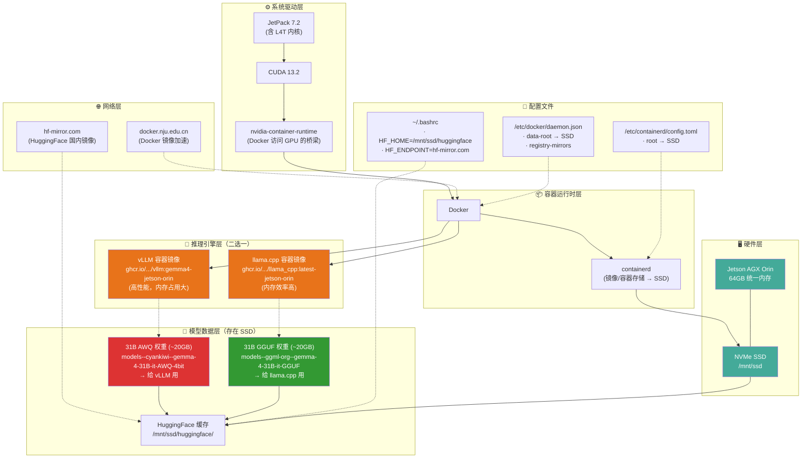

# 1. NVIDIA Jetson Orin AGX 安装

使用 Nvidia Jetson SDK Manager 安装 Jetson Orin AGX 系列设备的系统镜像。截止目前最新版为 7.2， Ubuntu 24.04。安装完成之后，安装如下软件包：

```bash
# 安装 Python
sudo apt update
sudo apt install python3
sudo apt install python3-pip

# 安装 jtop
sudo pip3 install -U pip
sudo pip3 install --break-system-packages -U jetson-stats
# https://github.com/rbonghi/jetson_stats
```

```bash
sudo apt install nvidia-jetpack
```

查看已经安装的组件：

```bash
 git clone https://github.com/jetsonhacks/jetsonUtilities.git
 # python jetsonInfo.py
```

安装 GTest：

```bash
sudo apt install libgtest-dev libgmock-dev
```

## 1.A. 参考及资源

### 1.A.1. 参考

- [NVIDIA Jetson Linux 36.4](https://developer.nvidia.cn/embedded/jetson-linux-r3640)：官方资料页面，包含组件以及驱动源码下载列表
- [Nvidia Jetson AGX Orin开发板配置与使用](https://zhaoxuhui.top/blog/2024/03/27/notes-on-nvidia-jetson-agx-orin-installation.html)：安装更多软件包，比如 SLAM，深度学习框架等。
- [Nvidia Jetson AGX Orin系统刷写](https://yanjingang.com/blog/?p=9092)

### 1.A.2. 资源

- [Jetson AI Lab -- 支持的LLM模型](https://www.jetson-ai-lab.com/models/)
- [JetPack 7.2: Jetson Software Goes Agentic with Jetson Linux 39.2](https://forums.developer.nvidia.com/t/jetpack-7-2-jetson-software-goes-agentic-with-jetson-linux-39-2/372056)
- [jetson skills](https://github.com/NVIDIA-AI-IOT/jetson-device-skills)：官方github仓库
- [Jetson AI Lab -- Supported Models](https://www.jetson-ai-lab.com/models/)：Jetson AI Lab 模型库

# 2. 在 Jetson Orin AGX 上挂载 SSD，挂载 Docker 目录及用户目录

> 本指南假设你已经把 M.2 NVMe SSD（约 1 TB）正确插入，系统能看到设备 `/dev/nvme0n1`（目前未分区）。所有操作均需要 **root**（使用 `sudo`）。

---

## 2.1. 创建分区 & 格式化

```bash
# 确认设备
lsblk -o NAME,SIZE,MODEL

# 使用 fdisk 创建一个主分区（占用整个磁盘）
sudo fdisk /dev/nvme0n1
# 在交互界面依次输入：
#   n   → 新建分区
#   p   → 主分区
#   1   → 分区号
#   （回车）默认起始扇区
#   （回车）默认结束扇区（使用剩余全部空间）
#   w   → 写入分区表并退出
```

完成后得到 `/dev/nvme0n1p1`。

格式化为 ext4（可根据需要换成 xfs、btrfs 等）：

```bash
sudo mkfs.ext4 -L nvme_ssd /dev/nvme0n1p1
```

查看 UUID（后续挂载会用到）：

```bash
sudo blkid /dev/nvme0n1p1
# 示例输出：/dev/nvme0n1p1: UUID="a1b2c3d4-e5f6-7890-abcd-ef1234567890" TYPE="ext4" PARTLABEL="nvme_ssd"
```

记下此 UUID（例如 `a1b2c3d4-e5f6-7890-abcd-ef1234567890`）。

---

## 2.2. 创建挂载点 & 加入开机自动挂载（/etc/fstab）

```bash
# 统一挂载点（可自行修改路径）
sudo mkdir -p /mnt/ssd

# 临时挂载测试
sudo mount /dev/nvme0n1p1 /mnt/ssd
df -hT /mnt/ssd   # 应看到约 1 TB 可用

# 写入 fstab（使用 UUID 更稳妥)
echo "UUID=a1b2c3d4-e5f6-7890-abcd-ef1234567890  /mnt/ssd  ext4  defaults,noatime  0  2" | sudo tee -a /etc/fstab

# 检查并生效
sudo mount -a
```

以后每次开机都会自动把 `/dev/nvme0n1p1` 挂载到 `/mnt/ssd`。

---

## 2.3. 把 Docker 镜像/容器数据放到 SSD

### 2.3.1. 推荐方案：修改 Docker 的 `data-root`

```bash
# 停止 Docker
sudo systemctl stop docker

# 创建目标目录并迁移原有数据（如果有）
sudo mkdir -p /mnt/ssd/docker
sudo rsync -aXS /var/lib/docker/. /mnt/ssd/docker/

# 配置 Docker 使用新目录
sudo mkdir -p /etc/docker
sudo tee /etc/docker/daemon.json > /dev/null <<'EOF'
{
  "data-root": "/mnt/ssd/docker"
}
EOF

# 重启 Docker
sudo systemctl start docker
sudo systemctl status docker   # 确保无错误

# 验证
docker info | grep "Docker Root Dir"
# 应显示： Docker Root Dir: /mnt/ssd/docker
```

_替代方案：_ 使用符号链接（停止 Docker 后 `mv /var/lib/docker /var/lib/docker.bak && ln -s /mnt/ssd/docker /var/lib/docker`），效果相同但不如 `daemon.json` 直观。

---

## 2.4. 把用户主目录（/home/hxf0223）也放到 SSD

如果你计划在用户目录下存放大量 Docker 镜像、离线 LLM 模型等，建议把 **整个用户主目录** 挂载到 SSD。

```bash
# 在 SSD 上创建对应目录
sudo mkdir -p /mnt/ssd/home/hxf0223

# 复制现有数据（保持权限、属性）
sudo rsync -aXS /home/hxf0223/. /mnt/ssd/home/hxf0223/

# 备份原目录
sudo mv /home/hxf0223 /home/hxf0223.bak

# 绑定挂载使 /home/hxf0223 指向 SSD
sudo mount --bind /mnt/ssd/home/hxf0223 /home/hxf0223

# 加入 fstab 以实现开机自动绑定挂载
echo "/mnt/ssd/home/hxf0223  /home/hxf0223  none  bind  0  0" | sudo tee -a /etc/fstab

# 验证
df -hT /home/hxf0223   # 应看到和 /mnt/ssd 相同的可用空间
mount | grep "on /home/hxf0223"
# 应显示类似： /mnt/ssd/home/hxf0223 on /home/hxf0223 type none (rw,relatime,bind)
```

> 如果你希望 **所有用户的主目录** 都放在 SSD，可把 `/mnt/ssd/home` 挂载到 `/home`，步骤类似。

---

## 2.5. 检查一切是否正常

```bash
# 检查挂载情况
df -hT /mnt/ssd /home/hxf0223 /var/lib/docker

# 检查 Docker 实际使用的目录
docker info | grep "Docker Root Dir"

# 检查用户目录是否真的指向 SSD
mount | grep "on /home/hxf0223"
```

如果输出均符合预期，说明你已经成功：

- 将 M.2 SSD 挂载为 `/mnt/ssd`（额外存储）。
- 将 Docker 数据目录迁移到 SSD（`/var/lib/docker` → `/mnt/ssd/docker`）。
- 将个人工作目录 `/home/hxf0223` 挂载到 SSD，后续的镜像拉取、模型下载、编译等 I/O 密集操作都会走高速 SSD。

---

## 2.6. 常见问题 & 小贴士

| 问题                                                           | 解决方案                                                                                                                    |
| -------------------------------------------------------------- | --------------------------------------------------------------------------------------------------------------------------- |
| **开机后挂载失败**                                             | 检查 `/etc/fstab` 是否有语法错误；用 `sudo mount -a` 测试；根据报错修正 UUID 或挂载选项。                                   |
| **Docker 启动后仍在用旧目录**                                  | 确认 `/etc/docker/daemon.json` JSON 合法（末尾无多余逗号）；重启 Docker 前先 `docker info` 查看 `Docker Root Dir`。         |
| **用户目录下出现权限问题**                                     | 迁移时使用了 `-aXS` 保持权限；如仍有问题，可 `sudo chown -R $USER:$USER /home/hxf0223`。                                    |
| **想给 SSD 加密**                                              | 在分区创建后使用 `cryptsetup luksFormat /dev/nvme0n1p1` + `cryptsetup open` 然后挂载解密后的 mapper；此文档未涉及加密细节。 |
| **想把 SSD 分成多个分区（例如一个给 Docker，一个给用户数据）** | 在 `fdisk` 中创建多个分区（如 `nvme0n1p1`、`nvme0n1p2`），分别格式化，按上面的方法分别挂载到不同目录。                      |

---

## 2.7. 验证迁移并清理 eMMC 上的备份以释放空间

在完成上述迁移后，建议检查数据是否确实已迁移到 SSD，并删除 eMMC 上可能残留的备份副本，以腾出存储空间。

### 2.7.1. 验证 Docker 是否真的在使用 SSD

```bash
# 显示 Docker 的实际数据根目录
sudo docker info | grep -i "Docker Root Dir"
```

**预期输出**：
`Docker Root Dir: /mnt/ssd/docker`

如果看到上述路径，说明 Docker 已经在使用挂载到 SSD 的目录；此时 `/var/lib/docker` 只是一个普通目录（挂载点），实际数据不再占用 eMMC 空间。

### 2.7.2. 验证 `/home/hxf0223` 是否已指向 SSD

```bash
# 查看挂载情况
mount | grep "on /home/hxf0223"
```

**预期输出**（示例）：
`/mnt/ssd/home/hxf0223 on /home/hxf0223 type none (rw,relatime,bind)`

或者检查是否是 bind‑mount：
`df -hT /home/hxf0223` 应该和 `/mnt/ssd` 显示相同的文件系统（ext4）和可用空间。

如果是这样，用户的实际数据已经在 SSD 上，eMMC 上只保存了 mount point 本身（几乎不占空间）。

### 2.7.3. 检查是否还有明显的备份占用空间

按照之前的步骤，迁移后通常会有以下两种备份形式：

| 位置                                   | 可能的内容                       | 大小检查命令                              |
| -------------------------------------- | -------------------------------- | ----------------------------------------- |
| `/var/lib/docker` （原始目录）         | 已迁移的 Docker 数据（若未删除） | `sudo du -sh /var/lib/docker`             |
| `/home/hxf0223.bak` （用户家目录备份） | 完整的 `/home/hxf0223` 副本      | `sudo du -sh /home/hxf0223.bak`（若存在） |

**示例检查**：

```bash
sudo du -sh /var/lib/docker
sudo du -sh /home/hxf0223.bak 2>/dev/null || echo "没有找到 .bak 目录"
```

> 在您当前的系统中，`/var/lib/docker` 只有约 212 KB，说明几乎没有占用空间；如果看到类似的几百 MB 或几 GB，那就需要考虑删除。

### 2.7.4. 安全清理（在确认无误后）

#### 2.7.4.1. 删除 Docker 原始目录的残留（如果仍然占用明显空间）

> **注意**：只有在你确认 `docker info` 的 `Docker Root Dir` 已经是 `/mnt/ssd/docker` 且 `/var/lib/docker` 中不含你需要的镜像/容器时才删除。

```bash
# 先再次确认 Docker 在使用 SSD（见步骤6.1)
sudo docker info | grep -i "Docker Root Dir"

# 如果确认无误，删除残留目录（保险起见先改名再删）
sudo mv /var/lib/docker /var/lib/docker.bak_$(date +%F)
# 等待一会儿，确认一切正常后再彻底删除
sudo rm -rf /var/lib/docker.bak_$(date +%F)
```

#### 2.7.4.2. 删除用户家目录备份（如果存在）

```bash
if [ -d /home/hxf0223.bak ]; then
    # 再次确认当前家目录已经是挂载到 SSD（见步骤6.2)
    mount | grep "on /home/hxf0223" && echo "家目录已正确挂载"
    # 先改名再删，防止误删
    sudo mv /home/hxf0223.bak /home/hxf0223.bak_$(date +%F)
    sudo rm -rf /home/hxf0223.bak_$(date +%F)
fi
```

#### 2.7.4.3. 可选：清理 Docker 未使用的镜像/缓存（进一步释放 SSD 空间）

```bash
sudo docker system prune -af   # 移除所有停止的容器、未使用的镜像、网络等
# 如果只想保留最近的，可改为：
# sudo docker system prune -a --filter "until=24h"
```

### 2.7.5. 再次确认系统状态

```bash
# 检查 eMMC 剩余空间（应该会有所提升)
df -hT /                # eMMC 根分区
df -hT /mnt/ssd         # SSD 挂载点
df -hT /home/hxf0223    # 应该和上面一致
```

如果一切正常，您已经把大量数据迁移到 SSD，并在 eMMC 上释放了可用空间。

---

**完成！** 现在你的 Jetson Orin AGX 已经把高速 M.2 SSD 用作系统额外存储、Docker 镜像/容器的默认存放位置，以及你个人的工作目录。后续拉取大型离线 LLM 模型、构建 Docker 镜像或进行其它 I/O 密集型工作都将享受到 SSD 的带宽和低延迟。祝使用愉快！如有其他细节需求（如单独挂接特定目录、使用 Btrfs/ZFS 等高级文件系统），随时告诉我.

---

# 3. 在 Jetson Orin AGX 上运行 Gemma 4 31B

- **设备**: NVIDIA Jetson AGX Orin (64GB eMMC)
- **系统**: Ubuntu 24.04, JetPack 7.2-b187, CUDA 13.2
- **引擎**：vLLM 或者 llama.cpp（两选一）

## 3.1. 运行 LLM 完整组件图



## 3.2. 环境概览

| 组件                     | 版本/状态                |
| ------------------------ | ------------------------ |
| JetPack                  | 7.2 ✅                   |
| CUDA                     | 13.2 ✅                  |
| nvidia-container-runtime | 1.19.1 ✅                |
| Docker                   | 已配置 NVIDIA runtime ✅ |
| SSD                      | 1TB，挂载 `/mnt/ssd` ✅  |

## 3.3. Docker 补充配置

在前面已配置 `data-root` 指向 SSD 的基础上，为支持 NVIDIA GPU 容器运行时和国内镜像加速，需补充以下设置。

### 3.3.1. `/etc/docker/daemon.json`

```json
{
  "runtimes": {
    "nvidia": {
      "args": [],
      "path": "nvidia-container-runtime"
    }
  },
  "data-root": "/mnt/ssd/docker",
  "max-concurrent-downloads": 6,
  "registry-mirrors": ["https://docker.nju.edu.cn"]
}
```

### 3.3.2. `/etc/containerd/config.toml`（关键行）

```toml
root = "/mnt/ssd/containerd"
state = "/mnt/ssd/containerd/state"
```

### 3.3.3. 存储路径一览

| 组件             | 存储路径               | 位置 |
| ---------------- | ---------------------- | :--: |
| Docker 镜像/容器 | `/mnt/ssd/docker`      | SSD  |
| Containerd       | `/mnt/ssd/containerd`  | SSD  |
| HuggingFace 缓存 | `/mnt/ssd/huggingface` | SSD  |
| 模型下载         | `HF_HOME` 控制         | SSD  |

## 3.4. HuggingFace 环境变量

写入 `~/.bashrc`：

```bash
export HF_HOME=/mnt/ssd/huggingface
export HF_HUB_CACHE=/mnt/ssd/huggingface/hub
export HF_ENDPOINT=https://hf-mirror.com
```

> **重要**: `huggingface.co` 在国内网络不可达，必须使用 `hf-mirror.com` 镜像。  
> 旧的 `huggingface-cli` 已废弃，改用 `hf` 命令。

## 3.5. Docker 镜像的双标签问题

```text
IMAGE                                                   ID
ghcr.io/nvidia-ai-iot/vllm:gemma4-jetson-orin           959f59339610
ghcr.nju.edu.cn/nvidia-ai-iot/vllm:gemma4-jetson-orin   959f59339610
```

两个标签指向同一镜像（ID 相同），实际磁盘只占一份空间（31.2GB）。

- `ghcr.nju.edu.cn/...` 是南大镜像站标签（用于 pull）
- `ghcr.io/...` 是官方标签（容器内脚本引用此标签）
- **两个标签都需要保留，不能删除任何一个**

## 3.6. 下载模型

```bash
# 使用 hf 工具从镜像站下载（约 20GB，需 1.5 小时）
export HF_ENDPOINT=https://hf-mirror.com
export HF_HOME=/mnt/ssd/huggingface
hf download cyankiwi/gemma-4-31B-it-AWQ-4bit
```

模型文件位置：

```text
/mnt/ssd/huggingface/hub/models--cyankiwi--gemma-4-31B-it-AWQ-4bit/snapshots/853ac120bc4d1cd4aa7ae66a412f76a35c4aca4f/
```

## 3.7. Docker 启动命令

```bash
sudo docker run -it --rm --pull always --name gemma4 --runtime=nvidia --network host \
  -v /mnt/ssd/huggingface:/data/models/huggingface \
  -e HF_ENDPOINT=https://hf-mirror.com \
  ghcr.io/nvidia-ai-iot/vllm:gemma4-jetson-orin \
  vllm serve cyankiwi/gemma-4-31B-it-AWQ-4bit \
    --port 18000 \
    --gpu-memory-utilization 0.70 \
    --max-model-len 32768 \
    --enable-auto-tool-choice \
    --reasoning-parser gemma4 \
    --tool-call-parser gemma4
```

### 3.7.1. 各参数含义

| 参数                                               | 含义                          |
| -------------------------------------------------- | ----------------------------- |
| `-it --rm`                                         | 交互式运行，退出自动删除容器  |
| `--pull always`                                    | 每次都检查镜像更新            |
| `--runtime=nvidia`                                 | 使用 NVIDIA 容器运行时        |
| `--network host`                                   | 使用主机网络栈                |
| `-v /mnt/ssd/huggingface:/data/models/huggingface` | 挂载 SSD 上的模型缓存到容器内 |
| `-e HF_ENDPOINT=https://hf-mirror.com`             | 设置 HuggingFace 镜像端点     |
| `--port 18000`                                     | 设置服务端口，默认 8000       |
| `--gpu-memory-utilization 0.70`                    | GPU 内存使用率 70%            |
| `--max-model-len 32768`                            | 最大上下文长度 32K            |
| `--enable-auto-tool-choice`                        | 启用自动工具选择              |
| `--reasoning-parser gemma4`                        | Gemma 4 推理解析器            |
| `--tool-call-parser gemma4`                        | Gemma 4 工具调用解析器        |

> **关键注意**:
>
> - 容器内 `HF_HOME` 预设为 `/data/models/huggingface`，挂载时必须匹配此路径
> - `huggingface.co` 在国内网络不可达，必须通过 `-e HF_ENDPOINT=https://hf-mirror.com` 走镜像
> - AGX Orin 64GB 共享内存中系统占用约 14GB，实际可用只有 ~47GB，默认 90% 内存利用率会 OOM，必须设为 `0.70`
> - 减少 `--max-model-len` 可进一步降低 KV cache 内存占用

## 3.8. 遇到过的错误及解决方案

### 3.8.1. `[Errno 101] Network is unreachable`

**原因**: 容器无法访问 `huggingface.co`

**解决**: 添加 `-e HF_ENDPOINT=https://hf-mirror.com`，并确保模型已通过 `hf download` 预先下载到 SSD。

### 3.8.2. `LocalEntryNotFoundError: Cannot find an appropriate cached snapshot folder`

**原因**: 挂载路径错误。容器 `HF_HOME` 在 `/data/models/huggingface`，而教程默认挂载到 `/root/.cache/huggingface`

**解决**: 将挂载改为 `-v /mnt/ssd/huggingface:/data/models/huggingface`

### 3.8.3. `ValueError: Free memory on device (47.51/61.4 GiB) is less than desired (0.9, 55.26 GiB)`

**原因**: AGX Orin 64GB 共享内存中系统占用约 14GB，实际可用只有 ~47GB，vLLM 默认 90% 内存利用率需要 55GB

**解决**: 设置 `--gpu-memory-utilization 0.70`（约 43GB），配合 `--max-model-len 32768` 减少 KV cache

## 3.9. 日常操作

### 3.9.1. 启动服务

```bash
sudo docker run -it --rm --pull always --name gemma4 --runtime=nvidia --network host \
  -v /mnt/ssd/huggingface:/data/models/huggingface \
  -e HF_ENDPOINT=https://hf-mirror.com \
  ghcr.io/nvidia-ai-iot/vllm:gemma4-jetson-orin \
  vllm serve cyankiwi/gemma-4-31B-it-AWQ-4bit \
    --port 18000 \
    --gpu-memory-utilization 0.70 \
    --max-model-len 32768 \
    --enable-auto-tool-choice \
    --reasoning-parser gemma4 \
    --tool-call-parser gemma4
```

### 3.9.2. 关闭服务

```bash
# 在启动终端按 Ctrl+C
# 或强制停止：
sudo docker ps                    # 查看容器名
sudo docker stop gemma4           # 停止容器
```

### 3.9.3. 测试模型

```bash
curl -sN http://127.0.0.1:18000/v1/chat/completions \
  -H 'Content-Type: application/json' \
  -d '{
    "model": "cyankiwi/gemma-4-31B-it-AWQ-4bit",
    "messages": [{"role": "user", "content": "你好"}],
    "chat_template_kwargs": {"enable_thinking": true},
    "stream": true
  }'
```

### 3.9.4. 如果内存不足

```bash
# 清除页面缓存
sudo sysctl -w vm.drop_caches=3

# 进一步降低参数
# --gpu-memory-utilization 0.60 --max-model-len 16384
```

### 3.9.5. 查看容器状态

```bash
# 查看运行中的容器
sudo docker ps

# 查看容器资源占用
sudo docker stats

# 查看镜像
sudo docker images
```

## 3.10. 全部模型 ID 参考

| 模型    | Orin MODEL_ID                          | 大小     |
| ------- | -------------------------------------- | -------- |
| E2B     | `google/gemma-4-E2B-it`                | 小       |
| E4B     | `google/gemma-4-E4B-it`                | 中       |
| 26B-A4B | `cyankiwi/gemma-4-26B-A4B-it-AWQ-4bit` | 大       |
| **31B** | **`cyankiwi/gemma-4-31B-it-AWQ-4bit`** | **最大** |

## 3.11. 关键注意事项总结

1. **容器 `HF_HOME` 不是默认路径**: 本容器预设为 `/data/models/huggingface`，挂载时必须匹配
2. **HuggingFace 必须走镜像**: `HF_ENDPOINT=https://hf-mirror.com` 不可省略
3. **AGX Orin 64GB 可用内存约 47GB**: 必须用 `--gpu-memory-utilization 0.70`
4. **双标签镜像正常**: 同一个镜像两个标签，不占额外空间，都需保留
5. **模型先下载再启动**: 用 `hf download` 预先下载到 SSD，容器启动时从缓存加载
6. **参考文档**: <https://www.jetson-ai-lab.com/tutorials/gemma4-on-jetson/>

## 3.12. 资料

- [Jetson AI Labs -- Supported Models](https://www.jetson-ai-lab.com/models/)：Jetson Orin AGX，支持 Gemma 4 12B / 26B-A4B / 31B
- [Gemma 4 on Jetson](https://www.jetson-ai-lab.com/tutorials/gemma4-on-jetson/)：官方安装教程
- [ModelScope -- gemma 4 31B](https://www.modelscope.cn/models/google/gemma-4-31B)
- [NemoClaw on Jetson](https://www.jetson-ai-lab.com/tutorials/nemoclaw/)

---

# 4. CLI 条件下连接 WIFI

```bash
# 查看网卡列表
nmcli device status

# 扫描附近的WiFi网络
nmcli device wifi list

# 连接到指定的WiFi网络（替换SSID_NAME和WIFI_PASSWORD）
sudo nmcli device wifi connect "SSID_NAME" password "WIFI_PASSWORD"
```
