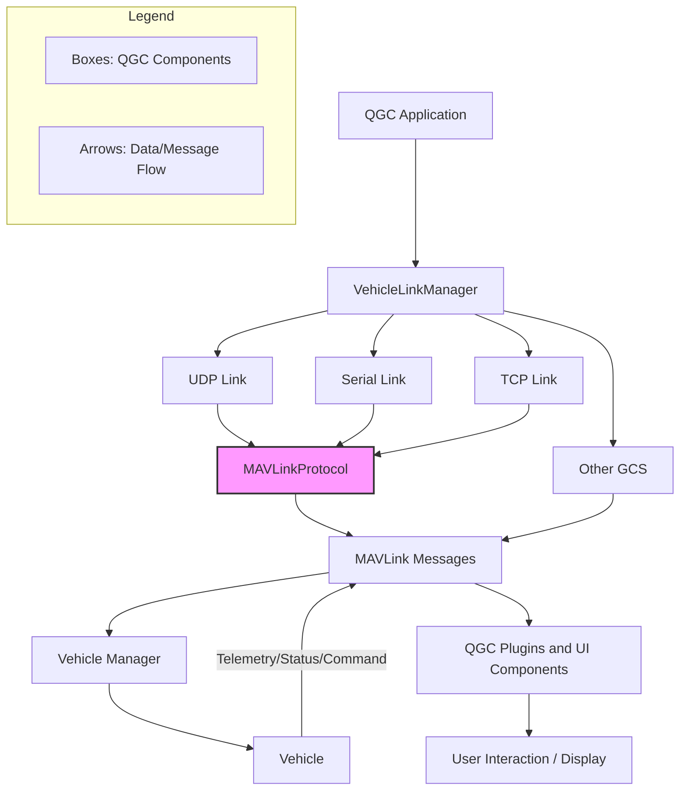

## 1. 资料 ##

### 1.1. QGC资料收集 ###

* [官方user guide](https://docs.qgroundcontrol.com/master/en/qgc-user-guide/)
* [官方dev guide](https://docs.qgroundcontrol.com/master/en/qgc-dev-guide/)
* [PR: QML: Various easy optimizations](https://github.com/mavlink/qgroundcontrol/pull/12968)
* [Simple GCS -- imGUI](https://github.com/Sanmopre/Simple_GCS)
* [Gazebo Sensors](https://gazebosim.org/api/sensors/8/introduction.html)：介绍了Gazebo中各种传感器的使用，包括IMU、GPS、相机等，这些传感器的数据可以通过MAVLink协议发送给QGC。
* [知乎 -- 非线性MC](https://www.zhihu.com/people/meng-hu-hang-pai/posts)：自动驾驶仿真、路径规划相关的文章。
* [QOpenHD](https://github.com/OpenHD/QOpenHD)：一个基于QGC的开源FPV图传系统，支持高清视频传输和遥控功能。
* [QGeoView](https://github.com/AmonRaNet/QGeoView)：基于`QGraphicsView`的地图显示，无`QML`。

### 1.2. QGC(master) 编译 ###

需要同时按照`runtime`版本和`devel`版本，安装完成之后，设置环境变量`GSTREAMER_1_0_ROOT_MSVC_X86_64`：

```bash
GSTREAMER_1_0_ROOT_MSVC_X86_64 = d:\dev_libs\gstreamer\1.0\msvc_x86_64\
```

* [Download GStreamer](https://gstreamer.freedesktop.org/download/#windows)
* [Gstreamer安装和使用](https://yadiq.github.io/2022/08/15/MediaGstreamerInstall/)
* [pkg-config for windows](https://github.com/lua-batteries/pkg-config/releases)
* [gstreamer 中文教程](https://www.cnblogs.com/O-ll-O/p/17438361.html)
* [常见问题：GStreamer的使用](https://kernel-zhang.github.io/posts/UsingGStreamer/)
* [PX4 -- Simulation](https://bresch.gitbooks.io/devguide/content/en/simulation/)

## 2. QGC 核心架构图示 ##

UML 核心类图（下载本地放大查看）：


核心系统分析图（下载本地放大查看）：


引用：

* [CSDN -- QGC(GGroundControl) 系统核心架构图](https://blog.csdn.net/qq_16504163/article/details/124005216)

## 3. QGC / MAVLink 通信流程 ##



通信流程说明

1. **QGroundControl 启动后**，由`VehicleLinkManager`管理与飞行器的所有链接（如UDP、串口、TCP等）。
2. **各类物理/网络连接**（UDP、串口、TCP）通过`VehicleLinkManager`建立。
3. **所有数据流**进入`MAVLinkProtocol`模块进行MAVLink消息的解析与封装。
4. **MAVLink消息**被分发到`Vehicle Manager`，并进一步与车辆（如无人机）交互。
5. **车辆端**会通过回传消息（如遥测、状态、命令响应等）同样经过上述流程返回QGC。
6. **QGC插件和UI组件**可订阅和处理这些消息，实现用户交互和数据显示。
7. **多地面站（GCS）通信**时，消息也可在多个QGC实例间流转。

> 以上流程图和说明基于 [QGC dev guide -- Communication Flow](https://docs.qgroundcontrol.com/master/en/qgc-dev-guide/communication_flow.html)。

* `LinkManager` 建立一个`UDP`监听端口(`14550`)，等待飞行器心跳包；
* 字节流经过`MAVLinkProtocol`转换为`MAVLink`消息包；
* 如果是心跳包，`MAVLinkProtocol`将消息包转发给`MultiVehicleManager`；
* `MultiVehicleManager`接收到心跳包，创建一个新的`Vehicle`对象，并将其添加到`_vehicles`列表中；
* `Vehicle`根据对应的`_firmwareType`、`_vehicleType`创建对应的`FirmwarePlugin`；
  * `FirmwarePlugin`根据`_vehicleType`创建对应的`AutoPilotPlugin`；
  * `Vehicle`实例创建完成，其持有的`ParameterLoader`实例发送`PARAM_REQUEST_LIST`给飞行器，请求飞行器参数列表（使用`pramater protocol`）；
  * 飞行器参数列表加载完成之后，`Vehicle`对应的`MissionManager`实例持有的`MissionManager`请求飞行任务`items`（使用`mission protol`）；

心跳数据流转：

`UDPWorker::dataReceived` -> `UDPLink::_onDataReceived` / `LinkInterface::bytesReceived` -> `MAVLinkProtocol::receiveBytes` / `MAVLinkProtocol::vehicleHeartbeatInfo` -> `MultiVehicleManager::_vehicleHeartbeatInfo` / new `Vehicle`。

### 3.1. 资料 ###

* [QGC通信流程](https://cccccrz.github.io/2023/07/12/QGC%E9%80%9A%E4%BF%A1%E6%B5%81%E7%A8%8B/)
* [Communication Flow](https://docs.qgroundcontrol.com/master/en/qgc-dev-guide/communication_flow.html)
* [QML与C++交互](https://cccccrz.github.io/2023/06/01/QML%E4%B8%8EC++%E4%BA%A4%E4%BA%92/)
