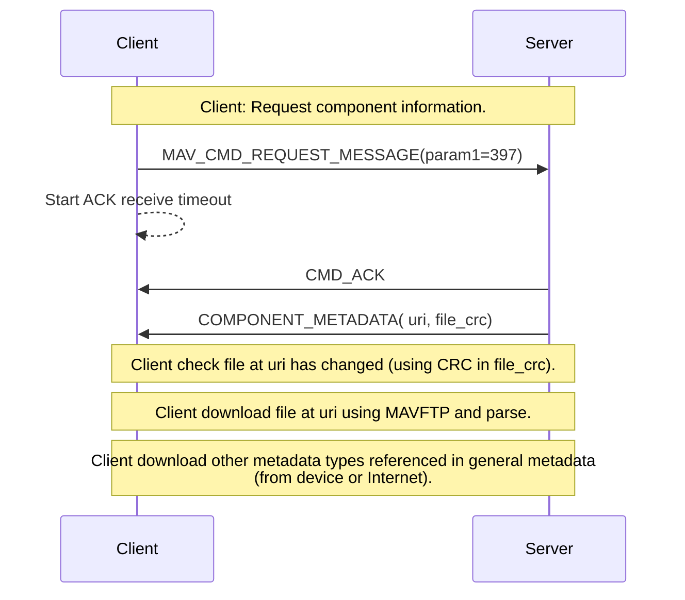

在收到飞机发来的心跳包后，消息发送给`MultiVehicleManager`，在`MultiVehicleManager`中，检查组件ID是否是`MAV_COMP_ID_AUTOPILOT1`，以及`vehicleType`不是`GCS`等之后，会创建一个`Vehicle`对象，并进入初始化流程。

> `mavlink_message_t`中已经包含了`sysid`、`compid`信息。而心跳包`mavlink_heartbeat_t`中则包含了`vehicleType`、`firmwareType`等信息。

> 需要注意的是，与飞控通信中，组件ID是固定的：`MAV_COMP_ID_AUTOPILOT1`，即每个飞控的组件ID都是1。

飞机发现、创建及初始化流程如下图所示：


主要初始流程入口在`InitialConnectStateMachine`中以状态机实现，且部分子流程也是以状态机实现（至多嵌套了三层状态机）：

> 由于获取信息需要使用同步方式，在`InitialConnectStateMachine`状态机中，使用回调方式处理应答`Ack`，在回调中进入下一个处理阶段。参见：[1. 请求的实现，以及模拟同步请求](#1-请求的实现以及模拟同步请求)。

```cpp
static constexpr const StateMachine::StateFn _rgStates[] = {
    _stateRequestAutopilotVersion,
    _stateRequestStandardModes,
    _stateRequestCompInfo,
    _stateRequestParameters,
    _stateRequestMission,
    _stateRequestGeoFence,
    _stateRequestRallyPoints,
    _stateSignalInitialConnectComplete
};
```

## 1. 请求的实现，以及模拟同步请求 ##

请求飞机信息，使用`MAV_CMD_REQUEST_MESSAGE`命令字，请求对应的消息ID（即子命令，比如请求飞机版本信息`MAVLINK_MSG_ID_AUTOPILOT_VERSION`），以及子命令的参数。另外，使用命令`MAV_CMD_SET_MESSAGE_INTERVAL`让飞机定期周期响应子命令消息。

飞机端收到`MESSAGE`消息之后，先返回一个响应`Ack`（`Ack`中包含`msgid`，以及响应码，比如`MAV_RESULT_ACCEPTED`）。`QGC`收到该消息，继续处理之前发送的请求，实现代码主要有两个函数入口：`Vehicle::requestMessage`，`Vehicle::_handleCommandAck(mavlink_message_t& message)`，以及一个主要的数据成员`QMap<int, QMap<int, RequestMessageInfo_t*>> _requestMessageInfoMap`。

`MAV_CMD_REQUEST_MESSAGE`消息的文档：[How to Request & Stream Messages](https://mavlink.io/en/mavgen_python/howto_requestmessages.html)。处理流程示例：

```text
你的程序                           飞控
   |                               |
   | 1. 发送 MAV_CMD_SET_MESSAGE_INTERVAL
   |----------------------------------------→  (请求：以1Hz发送BATTERY_STATUS)
   |
   |                               | 处理请求
   | 2. 接收 COMMAND_ACK  
   |←----------------------------------------  (确认已接受)
   |
   | 3. 等待 BATTERY_STATUS
   |
   |                               | 自动发送电池信息（周期:  1秒）
   | ← 接收 BATTERY_STATUS #1      |
   | ← 接收 BATTERY_STATUS #2      | （自动循环，无需请求）
   | ← 接收 BATTERY_STATUS #3      |
   | ← 接收 BATTERY_STATUS #4      |
```

## 2. 请求飞机版本信息(`MAVLINK_MSG_ID_AUTOPILOT_VERSION`) ##

主要获取飞机的编号、固件的`vender_id`、`product_id`，固件版本信息，以及`capabilities`（64位bitmask），`capabilities`相关枚举定义在`MAVLink`协议的`MAV_PROTOCOL_CAPABILITY`中。

## 3. 请求飞机标准模式(`MAVLINK_MSG_ID_AVAILABLE_MODES`) ##

主要获取飞机支持的标准模式。获取的模式列表用于设置给`FirmwarePlugin`，并在`Vehicle`中使用。

## 4. 请求组件元数据（META）信息 ##

由于这一步请求处理多个类型`META`数据文件，整个处理放在单独的模块（源码文件）`ComponentInformationManager`中，且也使用状态机来实现：请求`General`元数据、`Param`元数据、`Events`元数据、`Actuator`元数据。`General`是指组件的信息（主要是飞控自身），而`Events`，`Actuator`不一定每个组件都有。

请求每个子分类的`META`数据，分为几个步骤（还是用状态机实现），在`RequestMetaDataTypeStateMachine`中实现：请求数据文件的地址`URI`（返回URI，以及CRC），根据URI请求`META`数据文件内容（具有缓存功能，先比较CRC，不相等再请求远程`META`文件），即数据类型描述文件。比如下一个步骤请求飞机的参数信息，就需要将请求到的参数生成`Fact`，而`Fact`的类型信息就来自于参数的`META`数据文件。

> 在请求`META`数据文件的过程中，定义了两个数据类：1. `struct CompInfo::Uris`：存放`META`文件的`URI`，`CRC`，以及其他一些信息（如`Fallback`请求信息）。2. `CompInfo`，以及继承自`CompInfo`的上述几种`META`文件对应的子类：`CompInfoGeneral`，`CompInfoParam`，`CompInfoEvents`，`CompInfoActuators`。其中最重要也是首先需要请求的`META`文件是`CompInfoGeneral`，因为这个文件里面包含了设备支持的`META`文件类型列表（数据成员`QMap<COMP_METADATA_TYPE, Uris>   _supportedTypes;`）。后续几个请求，要先检查设备是否支持该类型的`META`文件。

> 在`ComponentInformationManager`中，维护了一个`QMap<uint8_t /* compId */, QMap<COMP_METADATA_TYPE, CompInfo*>> _compInfoMap;`，用于存放每个组件的各类`META`文件对象。这与上面所述的逻辑连接起来。

> `Events`是`MAVLink`协议中的一个系统事件和诊断机制，用于飞机端向地面站实时报告系统事件、警告和错误。相关文档：[Events Interface (WIP)](https://mavlink.io/en/services/events.html)。比如可能有如下事件：

```text
飞机端事件流：
    ├─ 电池低电量事件
    ├─ GPS 信号丢失事件
    ├─ IMU 过热警告
    ├─ 传感器校准失败
    ├─ 电机故障检测
    └─ 健康检查失败 (Health & Arming Checks)
```

### 4.1. META数据使用流程 ###

请求到的`META`数据文件，主要用于创建`FactMetaData`对象，进而创建`Fact`对象。以请求参数的`META`数据文件为例，流程如下所示：

```text
┌───────────────────────────────────────────────────┐
│           飞机端 (Autopilot)                       │
└───────────────────────────────────────────────────┘
                       │
                       │ MAVLink
                       │
         ┌─────────────▼──────────────┐
         │ ComponentInformation       │
         │ ┌──────────────────────┐   │
         │ │ COMP_METADATA_TYPE   │   │
         │ │ _PARAMETER           │   │
         │ │ (JSON 文件 URI)      │   │
         │ └──────────────────────┘   │
         └─────────────┬──────────────┘
                       │ 下载 JSON
                       │
         ┌─────────────▼──────────────┐
         │ CompInfoParam.setJson()    │
         │ (解析 JSON 文件)            │
         └─────────────┬──────────────┘
                       │
         ┌─────────────▼──────────────────────────────┐
         │ FactMetaData::createFromJsonObject()       │
         │ (将 JSON 转换为 FactMetaData 对象)          │
         └─────────────┬──────────────────────────────┘
                       │
         ┌─────────────▼──────────────────────────────┐
         │ ParameterManager                           │
         │ _nameToMetaDataMap[paramName]              │
         │ (存储所有参数的元数据)                       │
         └────────────────────────────────────────────┘
```

代码执行流程：

```cpp
// 1️⃣ 初始化连接时，请求参数的元数据
_stateRequestCompInfoEvents()
    └─► _requestTypeStateMachine.request(
            _compInfoMap[MAV_COMP_ID_AUTOPILOT1][COMP_METADATA_TYPE_PARAMETER]
        );

// 2️⃣ 下载 JSON 文件后，调用 setJson()
CompInfoParam::setJson(const QString& metadataJsonFileName)
{
    // 3️⃣ 解析 JSON 文件
    QJsonDocument jsonDoc = // 从文件读取
    QJsonArray rgParameters = jsonDoc["QGC_PARAMETERS"].toArray();
    
    // 4️⃣ 为每个参数创建 FactMetaData 对象
    for (QJsonValue parameterValue : rgParameters) {
        FactMetaData* newMetaData = 
            FactMetaData::createFromJsonObject(parameterValue.toObject(), ...);
        
        // 5️⃣ 存储到 map 中
        _nameToMetaDataMap[newMetaData->name()] = newMetaData;
    }
}

// 6️⃣ 后续使用时
FactMetaData* meta = _compInfoParam->factMetaDataForName("PARAM_NAME");
// 使用 meta 来验证、转换参数值
```

### 4.2. 对应的 MAVLink 服务 ###

请求`META`数据使用微服务[Component Metadata Protocol (WIP)](https://mavlink.io/en/services/component_information.html)，命令字：`MAVLINK_MSG_ID_COMPONENT_METADATA`。针对各个`META`数据类型，提供了枚举定义`COMP_METADATA_TYPE`。

请求流程图如下所示：



## 5. 请求系统参数列表 ##

这个步骤请求飞机的所有参数，使用`MAVLink`的微服务`Parameter Protocol`，在`QGC`的`ParameterManager`模块中实现，见上一篇`QGC代码架构解析：MAVLink参数服务及QGC参数管理模块`。

请求参数，依赖于上一步骤，即请求的参数`META`数据文件，用于创建参数对应的`FactMetaData`对象。

## 6. 请求任务列表（航点列表） ##

这个步骤使用`Mission Protocol`，直接调用`PlanManager::loadFromVehicle`下载飞机航点信息，进行初始化同步。具体参考下一篇`QGC代码架构解析：MAVLink Mission Protocol，以及 QGC 航点管理`。

由于`MAVLink v2`中，`Mission Protocol`不仅仅包含航点，还包含地理围栏(`GeoFence`)、降落点(`Rally Points`)等信息。所有这些部分都实现在`PlanManager`以及其继承子类中。

## 7. 请求地理围栏列表 ##

参考6。

## 8. 请求降落点列表 ##

参考6。

## 9. 初始化完成 ##

完成初始化，发送`signal`，通知`QML`界面。
